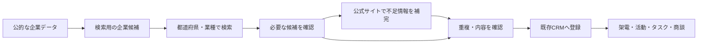

# 外部企業検索・営業リスト取込：要件案

2026-10-05の初期要件案。今回の確定事項はユーザー回答に基づく。以下は要件整理時点の記録であり、その後の実装・検証結果は[外部企業検索の実装記録](EXTERNAL-COMPANY-DISCOVERY.md)を参照する。実装と、今後検証するデータ充足率を区別する。

## 確定した目的

- 外部の企業を発見し、選んだ企業をLeadStackの営業リストへ取り込む。
- 都道府県別・業種別で検索したい。
- 確認したい項目は電話番号、Webサイト、従業員数。
- まず無料で検証し、不足する項目だけ有料データを検討する。
- 日本語、読みやすいデスクトップの表、少ないクリック、アクセント1色という既存方針を維持する。

現在公開中の企業画面は「登録済み企業」の検索。未公開の電話/法人番号検索を含めても外部企業の取得機能はない。新機能「企業を探す」と既存の「登録済み企業」を画面上で区別する。既存CRMは継続使用する。

## 未確定の選択

1. 法人単位・本店所在地から始めるか、最初から店舗/支店を対象にするか。暫定の推奨は法人・本店。ユーザー回答は未受領で、確定ではない。
2. 欠損項目のある企業も候補として表示するか、電話あり/全項目ありに制限するか。暫定の推奨は欠損を明示して表示し、電話あり等で絞り込む。ユーザー回答は未受領で、確定ではない。
3. 最初に取得率を測る都道府県と業種。小規模な検証結果から本実装の範囲を決める。
4. 期待する営業候補件数と更新頻度。初期は手動の更新開始を想定し、自動更新頻度は未決定。

## 推奨する取得・保存の分担

外部の公的企業データを候補の土台にし、LeadStackの検索用DBに必要な範囲を保存する。不足項目は取得が認められた企業公式サイトで補完する。検索を実行するたびに多数のサイトを巡回する方式にはしない。取得元との接続やクロールの利用条件を確認し、ユーザーによる利用申請が必要な場合は、その完了後に接続する。

### 無料データの適用範囲

- 国税庁法人番号データは法人番号・名称・所在地の照合に使う。営業向けの電話・Webサイト・業種・従業員数を埋めるデータとしては扱わない。[国税庁法人番号公表サイト](https://www.houjin-bangou.nta.go.jp/)
- Gビズインフォは業種・企業URL・従業員数等を得る第一候補。ただし項目の欠損があり、法人情報JSONの対象は法人活動情報を持つ法人に限定される。API仕様で電話番号項目は確認できない。[データ定義](https://help.info.gbiz.go.jp/hc/ja/articles/4804180304542)、[現行API v2仕様](https://api.info.gbiz.go.jp/hojin/v3/api-docs/v2)
- 同APIの検索パラメータに都道府県はあるが、業種は確認できない。検索応答だけで全属性もそろわないため、単純なAPI呼出しだけで都道府県×業種の検索が完成するとは約束しない。許可されたDLデータ、または上限を定めた地域内候補の詳細取得から、収録範囲を明示した検索DBを作る方式を比較する。[現行API v2仕様](https://api.info.gbiz.go.jp/hojin/v3/api-docs/v2)
- GビズインフォのAPI/DL利用には事前申請・トークンが必要。申請目的、利用制限、出典表示等を確認してから接続する。未申請でもすぐデータ接続できる仕様にはしない。[API・DL規約](https://help.info.gbiz.go.jp/hc/ja/articles/4999421139102)
- 有料データは不足項目・対象件数・費用・保持/再利用条件を確認して別途選定する。自動的な有料切替や契約は行わない。

### スクレイピングの初期範囲

- 対象は公式と確認できた企業サイトの会社概要・問い合わせ等の公開ページ。電話は代表/営業窓口等を区別し、個人の連絡先は収集対象にしない。
- 公式URLが取得できない場合は未確認として残す。社名だけで最初に見つかったサイトを公式と断定しない。URL探索は別の取得元/手動確認が必要で、無料で必ず解決するとは約束しない。
- 取得項目は電話番号、企業URL、従業員数とその根拠。Webページ全体を大量に転載・再配布する機能は作らない。
- robots.txt、サイト規約、提供APIを確認して対象可否を決め、同一サイトへの同時取得・頻度を制限する。robots.txtだけで法的な利用許可が得られるものとは扱わない。[robots.txt仕様](https://www.rfc-editor.org/rfc/rfc9309.html)
- ログイン、CAPTCHA、アクセス拒否を回避しない。403/429等では取得を停止・保留し、再試行回数を制限する。
- 従業員数を推測して確定値にしない。確認できない項目は状態とともに残す。AIサービスを前提にしない。

## 最小機能の要件

| ID | 要件 | 確認方法 |
|---|---|---|
| F01 | 「企業を探す」で都道府県・業種を組み合わせて検索 | 収録済みの既知データでAND条件、条件変更、0件を検証 |
| F02 | 企業名・所在地・業種・電話・Webサイト・従業員数・確認日・登録状態を一覧表示 | 欠損、長い名前、日本語表記、表の横スクロールを確認 |
| F03 | 「電話あり」「Webサイトあり」「従業員数あり」で絞込み | null/空欄/未確認を既知値と混同しない |
| F04 | 従業員数の範囲絞込みを追加候補とする | exact値と公表レンジの扱いを決めてから実装。現時点では必須検索条件にしない |
| F05 | ページ送り、件数、並び替え、条件クリア | 件数は検索DBの該当数。全国全社を網羅する件数に見せない |
| F06 | 検索だけではCRMに追加しない | 検索・詳細表示の前後で企業/活動/商談の件数が不変 |
| F07 | 複数選択→内容・重複確認→登録 | 取り込んだ件数と企業IDが一致。再送で二重登録しない |
| F08 | 登録済み企業へリンクを出す | 同一組織内の法人番号一致で新規重複を作らない |
| F09 | 不足情報の補完を開始し、進捗と結果を表示 | 確認中/取得済み/見つからない/失敗を区別。再読込で状態を保持 |
| F10 | 取り込んだ企業から既存架電フローへ進む | 企業・電話・担当者・活動の紐付けを確認 |

F03は欠損表示方針に応じて既定値を決める。F04は従業員数「表示」がユーザー要求であり、従業員数「絞込み」は追加提案である点を区別する。

## データの品質と同一企業の判定

- 法人番号を法人の主な照合キーにする。番号がない場合、名前・所在地・電話は候補提示に使い、自動で同一企業と断定しない。
- 県名と都道府県コードを正規化。業種は取得元コードと元の名称を保持し、画面上の分類へ対応付ける。調達品目などを業種と無条件に同一視しない。
- 業種不明は「不明」。名称のキーワードだけで確定業種に分類しない。推定分類を将来加える場合は人が確認する未確定値として別扱いにする。
- 電話は原表記・検索用正規化・用途（代表/支店/問い合わせ/不明）を区別する。
- 従業員数には数値または範囲、基準日、単体/連結、雇用形態を含むかなど取得できた定義を保持する。0人と未確認を区別する。
- 各採用項目に出典URL/データセット、取得日時、可能なら公表基準日を持たせる。取得日が新しくても内容の基準日が古いことはあり得る。
- 新しい取得値で営業担当が手編集した値を上書きしない。差分を確認して採用する。
- 各組織の取込状況・担当・メモ・活動を他組織へ見せない。候補情報の共有可否は取得元の再利用条件と合わせて決め、初期は組織内候補として扱う。

## 既存実装を使う範囲

- 企業・連絡先・架電・活動・タスク・商談の既存モデルを維持する。
- 既存のCSV確認取込・重複候補提示・再送対策を参考に、外部候補用の取込確認を追加する。
- employee_min/maxは既にDBにある。現状のCSV列には従業員数がないため、CSV経由で検証する場合は列と入力規則の追加が必要。
- 現在のsource自由記述1列だけでは項目別の根拠を保持できない。候補・取得状態・根拠・取込履歴の構造を追加する。
- 店舗/支店を含める場合は、組織内法人番号一意の既存企業テーブルとは別に拠点を扱う設計が必要。
- データ取得はサーバー側だけで実行。任意URL取得に対して内部/プライベートIPやリダイレクト先を検証し、タイムアウト・サイズ上限を設ける。キーをブラウザへ渡さない。

## 無料検証の進め方と合否

1. 1都道府県×1業種、50〜100社を目安に候補を検証する（件数は提案、取得可能性は未検証）。利用条件/申請を満たす取得元だけを使う。
2. 社名/所在地/法人番号の一致、業種の定義・欠損率、公式URL取得率、電話取得率、従業員数取得率、3項目すべてがそろう割合を計測する。分母と取得元を明示する。
3. 公式サイトによる補完前後の改善率、誤った公式URL/別企業の混入件数、所要時間、処理失敗数、データ量も記録する。
4. 許容する取得率・候補件数・更新頻度は、実測を見てユーザーと決める。測定前に無料データの網羅性を保証しない。
5. 業種・電話の取得率が不足すれば、業種別公的/許可名簿、手入力、承認された有料データを比較する。料金と使用条件が確認できない取得元は本番採用しない。

現在のSupabase無料枠はDB 500MB。全国データを無制限に同じDBへ複製する計画にはせず、検証対象の範囲・保存件数・保存期間・容量上限を決める。データ取得が無料でも保存/通信/処理が常に無料とは限らない。[Supabase料金](https://supabase.com/pricing)

## プルダウンのUI要件

公開サイトの専用テストアカウントでChromium 1440×1000、390×844を確認。業務データの保存はしていない。

- 都道府県/担当/状態はブラウザ標準select、業種はinput+datalist、組織切替はRadixメニューで実装と見た目が混在している。
- 都道府県の48候補が、PCで約471px、モバイル相当で約562pxの大きなリストとして開き、フォーム上部を覆うことを再現。標準selectの動作であり、CSSによる切れと断定しない。
- 確認した画面では文字欠け・横はみ出し・組織メニューの欠け・JS/consoleエラーは再現しなかった。ユーザーの実機で報告された事象すべてを特定したわけではない。
- 証拠: `/workspace/handoff/ui-audit/desktop-form-prefecture-open.png`、`mobile-form-prefecture-open.png`、`desktop-workspace-open.png`。

修正要件は以下とする。現時点では要件化のみで、UIの修正・公開はしていない。

- 閉じた時も選択値・未選択状態が読め、矢印や枠と重ならない。
- 開いた候補が画面外に切れず、スクロールとキーボード操作ができる。
- 長い業種名・企業名に対して省略と詳細確認を提供する。
- 都道府県・業種には検索可能な候補選択を使い、候補の高さを画面の空き領域に収める。少数の状態選択を含め、色・文字サイズ・余白を統一する。外部企業検索での分類コードとの対応を保つ。
- デスクトップとモバイルを実画面で確認。ブラウザ標準UIによる見た目の差とアプリの崩れを区別する。

## この資料作成時点の実施範囲

コードと公式資料の読取り、公開UIの確認、要件案の作成。外部データの利用申請・大量取得・スクレイピングの実行・有料契約・新サービス追加・DB変更・公開は行っていない。
